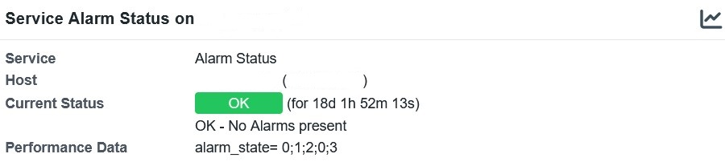
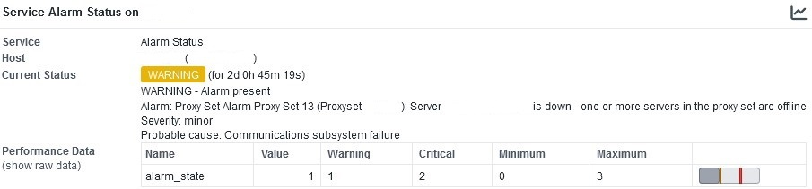
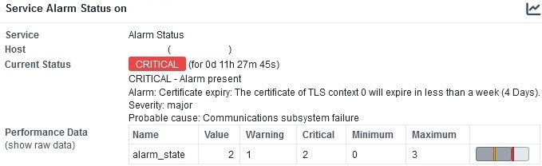

# check_audiocodes_sbc_alarms

A simple Nagios Plugin to monitor the alarms of AudioCodes SBCs.

### Description

This script extracts the alarm text, severity and probable cause values via SNMPv2.

### Dependencies

- Python 3
- OMD, Check_MK or other Monitoring solutions
- SNMPv2 enabled on your AudioCodes SBC

### Tested on the following systems

- OMD 5.0 (Ubuntu 22) with Python 3.10
- AudioCodes Mediant 2600 SBC (SW 7.20)
- AudioCodes VE SBC (SW 7.20)

### Installing

Copying it to your local plugin folder should be enough

### Usage

python3 check_audiocodes_sbc_alarms.py HOSTNAME SNMPv2-COMMUNITY

### OMD command and service definition

The command and service definitions for OMD sould look something like this:

````
define command {
  command_name                   check_audiocodes_sbc_alarms
  command_line                   python3 $USER5$/check_audiocodes_sbc_alarms.py $HOSTADDRESS$ $ARG1$
}

define service {
  service_description            Alarm Status
  host_name                      hostname_sbc
  use                            service-template-interval-5min
  check_command                  check_audiocodes_sbc_alarms!MySecretSnmpCommunity
}
````
### Output







### License

This project is licensed under the GNU General Public License v3.0 License - see the LICENSE.md file for details
